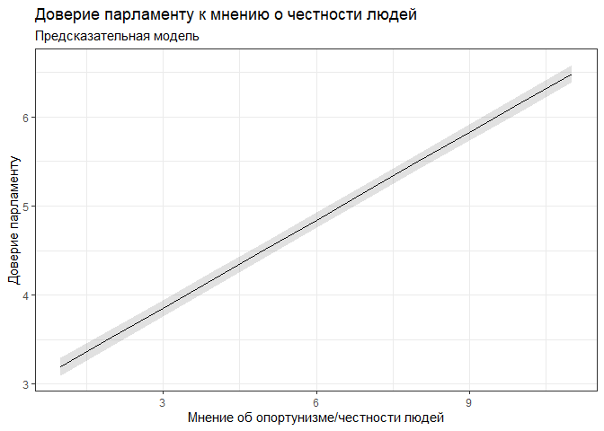

ESS, анализ порядковых переменных, порядковая и линейная регрессия
================
Pochukaev Daniil

## Описание

Поработаем с порядковой регрессией на примере базы данных European
Social Survey (ESS) последней волны (опросные данные):
<https://www.europeansocialsurvey.org/download.html?file=ESS9e03_1&c=&y=2018&loggedin>.

Анализ порядковых переменных нужен, когда мы хотим проанализировать как
связаны шкалы и какие-либо факторы, например какие взаимосвязи между
оценкой продукта потребителями или экспертами и различными показателями
производства/транспортировки/состава/… интересующего нас товара.

В данном мини-исследовании я посмотрю что влияет из интересующих меня
переменных на доверие парламенту в европейских странах. Для этого я планирую использовать порядковую и линейную регрессию.
аналогичные исследования можно провести в иных сферах, например какие взаимосвязи между 
оценкой продукта потребителями или экспертами и различными показателями
производства/транспортировки/состава/… интересующего нас товара.


### План работы:

-   работа с данным, подготовка их для дальнейшей работы

-   описательная статистика + визуализация данных

-   построение и проверка моделей + интерпретация полученных
    результатов + визуализация

-   построение предсказательных графиков и моделей + их интерпретация
``` r
library(haven) # загрузка данных
library(dplyr) # работа с данными
library(ggplot2) # визуализвация
library(sjPlot) # создание таблиц 
library(brant) # тест Бранта
library(tidyr) # работа с данными
library(car) # диагностика
```
## Работа с данными

``` r
ess <- read_dta ("C:/Users/ZBook/Downloads/ESS9e03_1.dta")
```

Смотрим данные:
``` r
head(ess)
```

    ## # A tibble: 6 x 572
    ##   name      essround edition proddate    idno cntry    nwspol netusoft     netustm
    ##   <chr>        <dbl> <chr>   <chr>      <dbl> <chr> <dbl+lbl> <dbl+lb>   <dbl+lbl>
    ## 1 ESS9e03_1        9 3.1     17.02.2021    27 AT           60 5 [Ever~   180      
    ## 2 ESS9e03_1        9 3.1     17.02.2021   137 AT           10 5 [Ever~    20      
    ## 3 ESS9e03_1        9 3.1     17.02.2021   194 AT           60 4 [Most~   180      
    ## 4 ESS9e03_1        9 3.1     17.02.2021   208 AT           45 5 [Ever~   120      
    ## 5 ESS9e03_1        9 3.1     17.02.2021   220 AT           30 1 [Neve~ NA(a) [Not~
    ## 6 ESS9e03_1        9 3.1     17.02.2021   254 AT           45 2 [Only~ NA(a) [Not~
    ## # ... with 563 more variables: ppltrst <dbl+lbl>, pplfair <dbl+lbl>,
    ## #   pplhlp <dbl+lbl>, polintr <dbl+lbl>, psppsgva <dbl+lbl>,
    ## #   actrolga <dbl+lbl>, psppipla <dbl+lbl>, cptppola <dbl+lbl>,
    ## #   trstprl <dbl+lbl>, trstlgl <dbl+lbl>, trstplc <dbl+lbl>, trstplt <dbl+lbl>,
    ## #   trstprt <dbl+lbl>, trstep <dbl+lbl>, trstun <dbl+lbl>, vote <dbl+lbl>,
    ## #   prtvtcat <dbl+lbl>, prtvtdbe <dbl+lbl>, prtvtdbg <dbl+lbl>,
    ## #   prtvtgch <dbl+lbl>, prtvtbcy <dbl+lbl>, prtvtecz <dbl+lbl>, ...

Сделаем новый датасет, в который отберем нужные нам переменные для
построения желаемых моделей Для этого будем использовать онлайн-кодбук
ESS: <http://nesstar.ess.nsd.uib.no/webview/>

**Какие переменные могут влиять на доверие парламенту?** Отберем
переменные (предложим гипотезу): предположим, что на доверие парламенту
(trstprl) могут влиять возраст (agea), гендер (gndr),
страна(cntry),число лет, затраченных на образование (eduyrs) минуты,
затраченные на просмотр/прослушивание/чтение новостей (nwspol), мнение о
честности людей (pplfair)(0 - не честные, 10 - абсолютно честные),
насколько человек интересуется политикой (polintr), считает ли себя
человек членом группы, подвергающейся дискриминации в этой стране
(dscrgrp).

Доверие парламенту (trstprl) - переменная, где респондент оценивал свое
доверие парламенту от 0 до 10.

для этого построим ряд гипотез: **H0** = на доверие парламент не влияет
никакая из вышеперечисленных переменных. **H1** = какая-то из переменных
или их совокупность влияют на доверие парламенту.

``` r
ess_new= ess%>%
  select(trstprl,agea, gndr, cntry, eduyrs, nwspol, pplfair, polintr, dscrgrp)
```

Посмотрим структуру полученного датасета

``` r
str(ess_new)
```

    ## tibble [49,519 x 9] (S3: tbl_df/tbl/data.frame)
    ##  $ trstprl: dbl+lbl [1:49519]     5,     7,     6,     0,     7,     6,     0,    ...
    ##    ..@ label       : chr "Trust in country's parliament"
    ##    ..@ format.stata: chr "%15.0g"
    ##    ..@ labels      : Named num [1:14] 0 1 2 3 4 5 6 7 8 9 ...
    ##    .. ..- attr(*, "names")= chr [1:14] "No trust at all" "1" "2" "3" ...
    ##  $ agea   : dbl+lbl [1:49519] 43, 67, 40, 63, 71, 64, 56, 74, 37, 22, 48, 59, 77, ...
    ##    ..@ label       : chr "Age of respondent, calculated"
    ##    ..@ format.stata: chr "%13.0g"
    ##    ..@ labels      : Named num NA
    ##    .. ..- attr(*, "names")= chr "Not available"
    ##  $ gndr   : dbl+lbl [1:49519] 1, 1, 2, 1, 2, 1, 1, 2, 1, 2, 1, 2, 1, 2, 1, 1, 1, 2...
    ##    ..@ label       : chr "Gender"
    ##    ..@ format.stata: chr "%12.0g"
    ##    ..@ labels      : Named num [1:3] 1 2 NA
    ##    .. ..- attr(*, "names")= chr [1:3] "Male" "Female" "No answer"
    ##  $ cntry  : chr [1:49519] "AT" "AT" "AT" "AT" ...
    ##   ..- attr(*, "label")= chr "Country"
    ##   ..- attr(*, "format.stata")= chr "%2s"
    ##  $ eduyrs : dbl+lbl [1:49519] 12, 12, 12, 11,  8, 13, 12, 11, 12, 12, 12, 12, 12, ...
    ##    ..@ label       : chr "Years of full-time education completed"
    ##    ..@ format.stata: chr "%12.0g"
    ##    ..@ labels      : Named num [1:3] NA NA NA
    ##    .. ..- attr(*, "names")= chr [1:3] "Refusal" "Don't know" "No answer"
    ##  $ nwspol : dbl+lbl [1:49519]  60,  10,  60,  45,  30,  45,  60,  30,  30,  25, 12...
    ##    ..@ label       : chr "News about politics and current affairs, watching, reading or listening, in min"
    ##    ..@ format.stata: chr "%12.0g"
    ##    ..@ labels      : Named num [1:3] NA NA NA
    ##    .. ..- attr(*, "names")= chr [1:3] "Refusal" "Don't know" "No answer"
    ##  $ pplfair: dbl+lbl [1:49519]  2,  8,  7,  9,  8,  7,  1,  7,  9,  4,  9,  8,  7, ...
    ##    ..@ label       : chr "Most people try to take advantage of you, or try to be fair"
    ##    ..@ format.stata: chr "%39.0g"
    ##    ..@ labels      : Named num [1:14] 0 1 2 3 4 5 6 7 8 9 ...
    ##    .. ..- attr(*, "names")= chr [1:14] "Most people try to take advantage of me" "1" "2" "3" ...
    ##  $ polintr: dbl+lbl [1:49519] 3, 2, 4, 3, 2, 2, 4, 3, 3, 4, 2, 2, 1, 4, 2, 1, 2, 3...
    ##    ..@ label       : chr "How interested in politics"
    ##    ..@ format.stata: chr "%21.0g"
    ##    ..@ labels      : Named num [1:7] 1 2 3 4 NA NA NA
    ##    .. ..- attr(*, "names")= chr [1:7] "Very interested" "Quite interested" "Hardly interested" "Not at all interested" ...
    ##  $ dscrgrp: dbl+lbl [1:49519]     2,     2,     2,     2,     2,     2,     2,    ...
    ##    ..@ label       : chr "Member of a group discriminated against in this country"
    ##    ..@ format.stata: chr "%12.0g"
    ##    ..@ labels      : Named num [1:5] 1 2 NA NA NA
    ##    .. ..- attr(*, "names")= chr [1:5] "Yes" "No" "Refusal" "Don't know" ...

Переделываю данные в более удобный для работы формат:
``` r
ess_new$eduyrs= as.numeric(ess_new$eduyrs)
ess_new$pplfair = as.factor(ess_new$pplfair)
ess_new$polintr = as.factor(ess_new$polintr)
ess_new$gndr = as.factor(ess_new$gndr)
ess_new$nwspol = as.numeric(ess_new$nwspol)
ess_new$agea = as.numeric(ess_new$agea)
ess_new$trstprl = as.factor(ess_new$trstprl)
ess_new$cntry = as.factor(ess_new$cntry)
ess_new$dscrgrp = as.factor(ess_new$dscrgrp )
```
``` r
summary(ess_new)
```

    ##     trstprl           agea       gndr          cntry           eduyrs     
    ##  5      : 8461   Min.   :15.00   1:23020   IT     : 2745   Min.   : 0.00  
    ##  7      : 5830   1st Qu.:36.00   2:26499   AT     : 2499   1st Qu.:11.00  
    ##  6      : 5632   Median :52.00             CZ     : 2398   Median :12.00  
    ##  0      : 5414   Mean   :51.07             DE     : 2358   Mean   :12.96  
    ##  3      : 5121   3rd Qu.:66.00             IE     : 2216   3rd Qu.:16.00  
    ##  (Other):17917   Max.   :90.00             GB     : 2204   Max.   :60.00  
    ##  NA's   : 1144   NA's   :222               (Other):35099   NA's   :708    
    ##      nwspol           pplfair      polintr      dscrgrp     
    ##  Min.   :   0.00   5      : 9677   1   : 5423   1   : 3697  
    ##  1st Qu.:  30.00   7      : 8989   2   :16016   2   :45379  
    ##  Median :  60.00   8      : 7561   3   :17837   NA's:  443  
    ##  Mean   :  85.48   6      : 5876   4   :10145               
    ##  3rd Qu.:  90.00   4      : 4109   NA's:   98               
    ##  Max.   :1440.00   (Other):12953                            
    ##  NA's   :572       NA's   :  354

Видно, что в отобранных переменных небольшое число NA и их удаление
не сильно повлияет на  данные.

Убираю строки, где есть NA и снова смотрим структуру данных:

``` r
ess_new = na.omit(ess_new)
str(ess_new)
```

    ## tibble [46,459 x 9] (S3: tbl_df/tbl/data.frame)
    ##  $ trstprl: Factor w/ 11 levels "0","1","2","3",..: 6 8 7 1 8 7 1 6 2 4 ...
    ##  $ agea   : num [1:46459] 43 67 40 63 71 64 56 74 37 22 ...
    ##  $ gndr   : Factor w/ 2 levels "1","2": 1 1 2 1 2 1 1 2 1 2 ...
    ##  $ cntry  : Factor w/ 29 levels "AT","BE","BG",..: 1 1 1 1 1 1 1 1 1 1 ...
    ##  $ eduyrs : num [1:46459] 12 12 12 11 8 13 12 11 12 12 ...
    ##  $ nwspol : num [1:46459] 60 10 60 45 30 45 60 30 30 25 ...
    ##  $ pplfair: Factor w/ 11 levels "0","1","2","3",..: 3 9 8 10 9 8 2 8 10 5 ...
    ##  $ polintr: Factor w/ 4 levels "1","2","3","4": 3 2 4 3 2 2 4 3 3 4 ...
    ##  $ dscrgrp: Factor w/ 2 levels "1","2": 2 2 2 2 2 2 2 2 2 2 ...
    ##  - attr(*, "na.action")= 'omit' Named int [1:3060] 29 33 54 57 70 73 84 116 151 173 ...
    ##   ..- attr(*, "names")= chr [1:3060] "29" "33" "54" "57" ...

Было удалено около 3-х тысяч строк, что составляет примерно
6% переменных. Нет смысла делать миссинги на место NA, вставляя на их
место взвешенное среднее или медианное значение, тк утерянных данных
очень мало. Также есть небольшой шанс что пропущенные ответы могут быть
специфичны (например, это будет определенная категория “не-ответов” в
связи с синзитивностю темы (например в вопросе о причислении себя к
дискриминируемой группе)), что также повлияло на выбор в пользу того,
чтобы просто убрать эти перменные. Также заметно, как были преобразованы
переменные в факторы или нумерические форматы для дальнейшей работы.

Некоторые переменые представлены в виде шкал, их также можно далее
преобразовать в нумерические переменные для дальнейшего анализа

``` r
ess_new$pplfair = as.numeric(ess_new$pplfair)
ess_new$polintr = as.numeric(ess_new$polintr)
```

## Описательная статистика + продолжение работы с данными + визуализация

Далее я буду работать с полученным датасетом. Для начала посмотрим общую
описательную статистику:

``` r
skimr::skim(ess_new)
```

|                                                  |         |
|:-------------------------------------------------|:--------|
| Name                                             | ess_new |
| Number of rows                                   | 46459   |
| Number of columns                                | 9       |
| \_\_\_\_\_\_\_\_\_\_\_\_\_\_\_\_\_\_\_\_\_\_\_   |         |
| Column type frequency:                           |         |
| factor                                           | 4       |
| numeric                                          | 5       |
| \_\_\_\_\_\_\_\_\_\_\_\_\_\_\_\_\_\_\_\_\_\_\_\_ |         |
| Group variables                                  | None    |

Data summary

**Variable type: factor**

| skim_variable | n_missing | complete_rate | ordered | n_unique | top_counts                             |
|:--------------|----------:|--------------:|:--------|---------:|:---------------------------------------|
| trstprl       |         0 |             1 | FALSE   |       11 | 5: 8170, 7: 5650, 6: 5481, 0: 5068     |
| gndr          |         0 |             1 | FALSE   |        2 | 2: 24698, 1: 21761                     |
| cntry         |         0 |             1 | FALSE   |       29 | IT: 2466, AT: 2376, DE: 2311, CZ: 2209 |
| dscrgrp       |         0 |             1 | FALSE   |        2 | 2: 42943, 1: 3516                      |

**Variable type: numeric**

| skim_variable | n_missing | complete_rate |  mean |     sd |  p0 | p25 | p50 | p75 | p100 | hist  |
|:--------------|----------:|--------------:|------:|-------:|----:|----:|----:|----:|-----:|:------|
| agea          |         0 |             1 | 51.10 |  18.46 |  15 |  37 |  52 |  66 |   90 | ▅▆▇▇▃ |
| eduyrs        |         0 |             1 | 13.04 |   4.14 |   0 |  11 |  12 |  16 |   60 | ▇▇▁▁▁ |
| nwspol        |         0 |             1 | 85.56 | 137.08 |   0 |  30 |  60 |  90 | 1440 | ▇▁▁▁▁ |
| pplfair       |         0 |             1 |  6.66 |   2.34 |   1 |   5 |   7 |   8 |   11 | ▂▃▇▇▂ |
| polintr       |         0 |             1 |  2.63 |   0.92 |   1 |   2 |   3 |   3 |    4 | ▂▇▁▇▅ |

Посмотрим на конкретные переменные.Начнем с зависимой переменной:
trstprl, посмотрим, как она распределена.

``` r
ggplot(ess_new, aes(as.numeric(trstprl))) + geom_histogram() + xlab("Доверие парламенту, распределение")  + ylab("") + theme_minimal()
```

<!-- -->

Можем также посмотреть какие пропорции распределения переменной на по
каждому ответу (по уровням перменной “Доверие парламенту”):

``` r
prop.table(xtabs(~as.numeric(ess_new$trstprl)))
```

    ## as.numeric(ess_new$trstprl)
    ##          1          2          3          4          5          6          7 
    ## 0.10908543 0.05241180 0.08112529 0.10566306 0.09797886 0.17585398 0.11797499 
    ##          8          9         10         11 
    ## 0.12161260 0.08573151 0.02886416 0.02369831

Можно также посмотреть как доверие парламенту в среднем распределено по
странам. Для этого сначала я переназвал уровни переменной cntry

``` r
levels(ess_new$cntry)[levels(ess_new$cntry)== "AT"] <-  "Austria"
levels(ess_new$cntry)[levels(ess_new$cntry)== "BE"] <-  "Belgium"
levels(ess_new$cntry)[levels(ess_new$cntry)== "BG"] <-  "Bulgaria"
levels(ess_new$cntry)[levels(ess_new$cntry)== "CH"] <-  "Switzerland"
levels(ess_new$cntry)[levels(ess_new$cntry)== "CY"] <-  "Cyprus"
levels(ess_new$cntry)[levels(ess_new$cntry)== "CZ"] <-  "Czechia"
levels(ess_new$cntry)[levels(ess_new$cntry)== "DE"] <-  "Germany"
levels(ess_new$cntry)[levels(ess_new$cntry)== "DK"] <-  "Denmark"
levels(ess_new$cntry)[levels(ess_new$cntry)== "EE"] <-  "Estonia"
levels(ess_new$cntry)[levels(ess_new$cntry)== "ES"] <-  "Spain"
levels(ess_new$cntry)[levels(ess_new$cntry)== "FI"] <-  "Finland"
levels(ess_new$cntry)[levels(ess_new$cntry)== "FR"] <-  "France"
levels(ess_new$cntry)[levels(ess_new$cntry)== "GB"] <-  "United Kingdom"
levels(ess_new$cntry)[levels(ess_new$cntry)== "HR"] <-  "Croatia"
levels(ess_new$cntry)[levels(ess_new$cntry)== "HU"] <-  "Hungary"
levels(ess_new$cntry)[levels(ess_new$cntry)== "IE"] <-  "Ireland"
levels(ess_new$cntry)[levels(ess_new$cntry)== "IS"] <-  "Iceland"
levels(ess_new$cntry)[levels(ess_new$cntry)== "IT"] <-  "Italy"
levels(ess_new$cntry)[levels(ess_new$cntry)== "LT"] <-  "Lithuania"
levels(ess_new$cntry)[levels(ess_new$cntry)== "LV"] <-  "Latvia"
levels(ess_new$cntry)[levels(ess_new$cntry)== "ME"] <-  "Montenegro"
levels(ess_new$cntry)[levels(ess_new$cntry)== "NL"] <-  "Netherlands"
levels(ess_new$cntry)[levels(ess_new$cntry)== "NO"] <-  "Norway"
levels(ess_new$cntry)[levels(ess_new$cntry)== "PL"] <-  "Poland"
levels(ess_new$cntry)[levels(ess_new$cntry)== "PT"] <-  "Portugal"
levels(ess_new$cntry)[levels(ess_new$cntry)== "RS"] <-  "Serbia"
levels(ess_new$cntry)[levels(ess_new$cntry)== "SE"] <-  "Sweden"
levels(ess_new$cntry)[levels(ess_new$cntry)== "SI"] <-  "Slovenia"
levels(ess_new$cntry)[levels(ess_new$cntry)== "SK"] <-  "Slovakia"
```

Поменяем также кодировку в некоторых других переменных, для удобства при
дальнейшей визуализации:

``` r
ess_new_2 = ess_new # дублируем датасет, на случае, если понадобиться вернуться к прошлой его версии
levels(ess_new$gndr)[levels(ess_new_2$gndr)== "1"] <-  "Мужчины"
levels(ess_new$gndr)[levels(ess_new_2$gndr)== "2"] <-  "Женщины"
levels(ess_new$dscrgrp)[levels(ess_new_2$dscrgrp)== "1"] <-  "Считаю себя членом дискриминируемой группой"
levels(ess_new$dscrgrp)[levels(ess_new_2$dscrgrp)== "2"] <-  "Не являюсь частью дискриминируемой группы"
```

Далее я строю график:

``` r
ess_new %>%
  group_by(cntry) %>%
  summarise(
    mean = mean(as.numeric(trstprl))
  ) %>%
  ggplot()+ geom_bar(aes(reorder(x = cntry, mean), y = mean), stat = "identity", alpha= 0.7)+ coord_flip()+
  theme_minimal()+ xlab("") + ylab("Доверие парламенту (среднее по стране)")
```

<!-- -->

Мы видим, что наибольшее среднее доверие парламенту у нас в таких
странах как Норвегия и Швейцария (между 7 и 8), а наименьшее - в
Хорватии и Болгарии (между 3 и 4)

Можем также посмотреть распределение по другим переменным:

``` r
ggplot(ess_new, aes(as.numeric(agea))) + geom_bar(alpha = 0.7) + xlab("возраст, распределение")  + ylab("") + theme_minimal()
```

<!-- -->

``` r
ggplot(ess_new, aes(as.numeric(eduyrs))) + geom_histogram(alpha = 0.7) + xlab("Годы на образование, распределение")  + ylab("") + theme_minimal()
```

<!-- -->

``` r
ggplot(ess_new, aes(as.numeric(nwspol))) + geom_histogram(alpha = 0.7) + xlab("Время затраченное на новости")  + ylab("") + theme_minimal()
```

<!-- -->

``` r
ggplot(ess_new, aes(as.numeric(pplfair))) + geom_bar(alpha = 0.7) + xlab("Доверие людям(насколько люди честные, распределение")  + ylab("") + theme_minimal()
```

<!-- -->

``` r
ggplot(ess_new, aes(polintr)) + geom_bar(alpha = 0.7) + xlab("Интерес к политике, распределение")  + ylab("") + theme_minimal()
```

<!-- -->

``` r
ggplot(ess_new, aes(dscrgrp)) + geom_bar(alpha = 0.7) + xlab("Дискриминируемая группа, распределение")  + ylab("") + theme_minimal()
```

<!-- -->

``` r
ggplot(ess_new, aes(gndr)) + geom_bar(alpha = 0.7) + xlab("Гендер, распределение")  + ylab("") + theme_minimal()
```

<!-- -->

Видим, что в переменных “образование” и “Время, затраченное на новости”
пренебрежительное малое значение после значений 30 и 1100
соответственно, удалим их, чтобы они не мешали в качестве аутлайеров (не
смещали выборку).

``` r
ess_new_ = ess_new # создадим резерв данных, на случай, если удаленных данных окажется слишком много
ess_new$nwspol[ess_new$eduyrs > 30]= NA
ess_new$nwspol[ess_new$nwspol > 1100]= NA
ess_new = na.omit(ess_new)
str(ess_new)
```

    ## tibble [46,275 x 9] (S3: tbl_df/tbl/data.frame)
    ##  $ trstprl: Factor w/ 11 levels "0","1","2","3",..: 6 8 7 1 8 7 1 6 2 4 ...
    ##  $ agea   : num [1:46275] 43 67 40 63 71 64 56 74 37 22 ...
    ##  $ gndr   : Factor w/ 2 levels "Мужчины","Женщины": 1 1 2 1 2 1 1 2 1 2 ...
    ##  $ cntry  : Factor w/ 29 levels "Austria","Belgium",..: 1 1 1 1 1 1 1 1 1 1 ...
    ##  $ eduyrs : num [1:46275] 12 12 12 11 8 13 12 11 12 12 ...
    ##  $ nwspol : num [1:46275] 60 10 60 45 30 45 60 30 30 25 ...
    ##  $ pplfair: num [1:46275] 3 9 8 10 9 8 2 8 10 5 ...
    ##  $ polintr: num [1:46275] 3 2 4 3 2 2 4 3 3 4 ...
    ##  $ dscrgrp: Factor w/ 2 levels "Считаю себя членом дискриминируемой группой",..: 2 2 2 2 2 2 2 2 2 2 ...
    ##  - attr(*, "na.action")= 'omit' Named int [1:184] 1471 2511 2521 2522 2534 2562 2603 2608 2699 2844 ...
    ##   ..- attr(*, "names")= chr [1:184] "1471" "2511" "2521" "2522" ...

Было удалено чуть меньше 200 переменных, что допустимо. Распределение
образование стало более “Нормальным”

Посмотрим также, как визуально связаны вера в честность людей и доверие
парламенту?

``` r
ggplot(ess_new, aes(as.numeric(pplfair), as.numeric(trstprl))) + geom_jitter(stat="identity", alpha= 0.07, color = "OliveDrab") + geom_smooth(method="lm",color = "DarkGreen", size = 1.5) + xlab("вера в честность людей") + ylab("Доверие парламенту") + theme_bw()
```

    ## `geom_smooth()` using formula 'y ~ x'

<!-- -->

Видно, что в европейских странах в среднем, чем больше вера в то, что
другие люди честные, тем больше в среднем доверие парламенту.

Можно аналогичным образом посмотреть корреляцию доверия парламенту с
годами, потраченными на образование:

``` r
ggplot(ess_new, aes(eduyrs, as.numeric(trstprl))) + geom_jitter(stat="identity", alpha= 0.1, color = "CornflowerBlue") + geom_smooth(method="lm",color = "MediumBlue", size = 1.5) + xlab("Число лет очного/заочного обучения") + ylab("Доверие парламенту") + theme_bw()
```

    ## `geom_smooth()` using formula 'y ~ x'

<!-- -->

Видно, что в европейских странах в среднем, чем больше вера в то, что
другие люди честные, тем больше в среднем доверие парламенту.

## Построение моделей

Попробуем теперь построить модели, чтобы более точно посмотреть
взаимосвязь между переменными. ДЛя начала построим обычную ols
регрессию, включив туда все переменные.

``` r
lm_model = lm(as.numeric(trstprl)~ ., ess_new)
tab_model(lm_model)
```

    ## Argument 'df_method' is deprecated. Please use 'ci_method' instead.

<table style="border-collapse:collapse; border:none;">
<tr>
<th style="border-top: double; text-align:center; font-style:normal; font-weight:bold; padding:0.2cm;  text-align:left; ">
 
</th>
<th colspan="3" style="border-top: double; text-align:center; font-style:normal; font-weight:bold; padding:0.2cm; ">
as.numeric(trstprl)
</th>
</tr>
<tr>
<td style=" text-align:center; border-bottom:1px solid; font-style:italic; font-weight:normal;  text-align:left; ">
Predictors
</td>
<td style=" text-align:center; border-bottom:1px solid; font-style:italic; font-weight:normal;  ">
Estimates
</td>
<td style=" text-align:center; border-bottom:1px solid; font-style:italic; font-weight:normal;  ">
CI
</td>
<td style=" text-align:center; border-bottom:1px solid; font-style:italic; font-weight:normal;  ">
p
</td>
</tr>
<tr>
<td style=" padding:0.2cm; text-align:left; vertical-align:top; text-align:left; ">
(Intercept)
</td>
<td style=" padding:0.2cm; text-align:left; vertical-align:top; text-align:center;  ">
5.22
</td>
<td style=" padding:0.2cm; text-align:left; vertical-align:top; text-align:center;  ">
5.02 – 5.41
</td>
<td style=" padding:0.2cm; text-align:left; vertical-align:top; text-align:center;  ">
<strong>\<0.001</strong>
</td>
</tr>
<tr>
<td style=" padding:0.2cm; text-align:left; vertical-align:top; text-align:left; ">
agea
</td>
<td style=" padding:0.2cm; text-align:left; vertical-align:top; text-align:center;  ">
-0.01
</td>
<td style=" padding:0.2cm; text-align:left; vertical-align:top; text-align:center;  ">
-0.01 – -0.00
</td>
<td style=" padding:0.2cm; text-align:left; vertical-align:top; text-align:center;  ">
<strong>\<0.001</strong>
</td>
</tr>
<tr>
<td style=" padding:0.2cm; text-align:left; vertical-align:top; text-align:left; ">
gndr \[Женщины\]
</td>
<td style=" padding:0.2cm; text-align:left; vertical-align:top; text-align:center;  ">
-0.00
</td>
<td style=" padding:0.2cm; text-align:left; vertical-align:top; text-align:center;  ">
-0.05 – 0.04
</td>
<td style=" padding:0.2cm; text-align:left; vertical-align:top; text-align:center;  ">
0.850
</td>
</tr>
<tr>
<td style=" padding:0.2cm; text-align:left; vertical-align:top; text-align:left; ">
cntry \[Belgium\]
</td>
<td style=" padding:0.2cm; text-align:left; vertical-align:top; text-align:center;  ">
-0.43
</td>
<td style=" padding:0.2cm; text-align:left; vertical-align:top; text-align:center;  ">
-0.57 – -0.28
</td>
<td style=" padding:0.2cm; text-align:left; vertical-align:top; text-align:center;  ">
<strong>\<0.001</strong>
</td>
</tr>
<tr>
<td style=" padding:0.2cm; text-align:left; vertical-align:top; text-align:left; ">
cntry \[Bulgaria\]
</td>
<td style=" padding:0.2cm; text-align:left; vertical-align:top; text-align:center;  ">
-2.15
</td>
<td style=" padding:0.2cm; text-align:left; vertical-align:top; text-align:center;  ">
-2.29 – -2.01
</td>
<td style=" padding:0.2cm; text-align:left; vertical-align:top; text-align:center;  ">
<strong>\<0.001</strong>
</td>
</tr>
<tr>
<td style=" padding:0.2cm; text-align:left; vertical-align:top; text-align:left; ">
cntry \[Switzerland\]
</td>
<td style=" padding:0.2cm; text-align:left; vertical-align:top; text-align:center;  ">
0.91
</td>
<td style=" padding:0.2cm; text-align:left; vertical-align:top; text-align:center;  ">
0.76 – 1.07
</td>
<td style=" padding:0.2cm; text-align:left; vertical-align:top; text-align:center;  ">
<strong>\<0.001</strong>
</td>
</tr>
<tr>
<td style=" padding:0.2cm; text-align:left; vertical-align:top; text-align:left; ">
cntry \[Cyprus\]
</td>
<td style=" padding:0.2cm; text-align:left; vertical-align:top; text-align:center;  ">
-0.89
</td>
<td style=" padding:0.2cm; text-align:left; vertical-align:top; text-align:center;  ">
-1.09 – -0.70
</td>
<td style=" padding:0.2cm; text-align:left; vertical-align:top; text-align:center;  ">
<strong>\<0.001</strong>
</td>
</tr>
<tr>
<td style=" padding:0.2cm; text-align:left; vertical-align:top; text-align:left; ">
cntry \[Czechia\]
</td>
<td style=" padding:0.2cm; text-align:left; vertical-align:top; text-align:center;  ">
-0.74
</td>
<td style=" padding:0.2cm; text-align:left; vertical-align:top; text-align:center;  ">
-0.88 – -0.61
</td>
<td style=" padding:0.2cm; text-align:left; vertical-align:top; text-align:center;  ">
<strong>\<0.001</strong>
</td>
</tr>
<tr>
<td style=" padding:0.2cm; text-align:left; vertical-align:top; text-align:left; ">
cntry \[Germany\]
</td>
<td style=" padding:0.2cm; text-align:left; vertical-align:top; text-align:center;  ">
-0.45
</td>
<td style=" padding:0.2cm; text-align:left; vertical-align:top; text-align:center;  ">
-0.58 – -0.32
</td>
<td style=" padding:0.2cm; text-align:left; vertical-align:top; text-align:center;  ">
<strong>\<0.001</strong>
</td>
</tr>
<tr>
<td style=" padding:0.2cm; text-align:left; vertical-align:top; text-align:left; ">
cntry \[Denmark\]
</td>
<td style=" padding:0.2cm; text-align:left; vertical-align:top; text-align:center;  ">
0.36
</td>
<td style=" padding:0.2cm; text-align:left; vertical-align:top; text-align:center;  ">
0.21 – 0.51
</td>
<td style=" padding:0.2cm; text-align:left; vertical-align:top; text-align:center;  ">
<strong>\<0.001</strong>
</td>
</tr>
<tr>
<td style=" padding:0.2cm; text-align:left; vertical-align:top; text-align:left; ">
cntry \[Estonia\]
</td>
<td style=" padding:0.2cm; text-align:left; vertical-align:top; text-align:center;  ">
-0.34
</td>
<td style=" padding:0.2cm; text-align:left; vertical-align:top; text-align:center;  ">
-0.48 – -0.20
</td>
<td style=" padding:0.2cm; text-align:left; vertical-align:top; text-align:center;  ">
<strong>\<0.001</strong>
</td>
</tr>
<tr>
<td style=" padding:0.2cm; text-align:left; vertical-align:top; text-align:left; ">
cntry \[Spain\]
</td>
<td style=" padding:0.2cm; text-align:left; vertical-align:top; text-align:center;  ">
-1.06
</td>
<td style=" padding:0.2cm; text-align:left; vertical-align:top; text-align:center;  ">
-1.21 – -0.91
</td>
<td style=" padding:0.2cm; text-align:left; vertical-align:top; text-align:center;  ">
<strong>\<0.001</strong>
</td>
</tr>
<tr>
<td style=" padding:0.2cm; text-align:left; vertical-align:top; text-align:left; ">
cntry \[Finland\]
</td>
<td style=" padding:0.2cm; text-align:left; vertical-align:top; text-align:center;  ">
0.29
</td>
<td style=" padding:0.2cm; text-align:left; vertical-align:top; text-align:center;  ">
0.14 – 0.43
</td>
<td style=" padding:0.2cm; text-align:left; vertical-align:top; text-align:center;  ">
<strong>\<0.001</strong>
</td>
</tr>
<tr>
<td style=" padding:0.2cm; text-align:left; vertical-align:top; text-align:left; ">
cntry \[France\]
</td>
<td style=" padding:0.2cm; text-align:left; vertical-align:top; text-align:center;  ">
-1.12
</td>
<td style=" padding:0.2cm; text-align:left; vertical-align:top; text-align:center;  ">
-1.26 – -0.98
</td>
<td style=" padding:0.2cm; text-align:left; vertical-align:top; text-align:center;  ">
<strong>\<0.001</strong>
</td>
</tr>
<tr>
<td style=" padding:0.2cm; text-align:left; vertical-align:top; text-align:left; ">
cntry \[United Kingdom\]
</td>
<td style=" padding:0.2cm; text-align:left; vertical-align:top; text-align:center;  ">
-1.04
</td>
<td style=" padding:0.2cm; text-align:left; vertical-align:top; text-align:center;  ">
-1.18 – -0.91
</td>
<td style=" padding:0.2cm; text-align:left; vertical-align:top; text-align:center;  ">
<strong>\<0.001</strong>
</td>
</tr>
<tr>
<td style=" padding:0.2cm; text-align:left; vertical-align:top; text-align:left; ">
cntry \[Croatia\]
</td>
<td style=" padding:0.2cm; text-align:left; vertical-align:top; text-align:center;  ">
-2.53
</td>
<td style=" padding:0.2cm; text-align:left; vertical-align:top; text-align:center;  ">
-2.67 – -2.39
</td>
<td style=" padding:0.2cm; text-align:left; vertical-align:top; text-align:center;  ">
<strong>\<0.001</strong>
</td>
</tr>
<tr>
<td style=" padding:0.2cm; text-align:left; vertical-align:top; text-align:left; ">
cntry \[Hungary\]
</td>
<td style=" padding:0.2cm; text-align:left; vertical-align:top; text-align:center;  ">
-0.30
</td>
<td style=" padding:0.2cm; text-align:left; vertical-align:top; text-align:center;  ">
-0.45 – -0.15
</td>
<td style=" padding:0.2cm; text-align:left; vertical-align:top; text-align:center;  ">
<strong>\<0.001</strong>
</td>
</tr>
<tr>
<td style=" padding:0.2cm; text-align:left; vertical-align:top; text-align:left; ">
cntry \[Ireland\]
</td>
<td style=" padding:0.2cm; text-align:left; vertical-align:top; text-align:center;  ">
-0.78
</td>
<td style=" padding:0.2cm; text-align:left; vertical-align:top; text-align:center;  ">
-0.92 – -0.64
</td>
<td style=" padding:0.2cm; text-align:left; vertical-align:top; text-align:center;  ">
<strong>\<0.001</strong>
</td>
</tr>
<tr>
<td style=" padding:0.2cm; text-align:left; vertical-align:top; text-align:left; ">
cntry \[Iceland\]
</td>
<td style=" padding:0.2cm; text-align:left; vertical-align:top; text-align:center;  ">
-0.55
</td>
<td style=" padding:0.2cm; text-align:left; vertical-align:top; text-align:center;  ">
-0.73 – -0.36
</td>
<td style=" padding:0.2cm; text-align:left; vertical-align:top; text-align:center;  ">
<strong>\<0.001</strong>
</td>
</tr>
<tr>
<td style=" padding:0.2cm; text-align:left; vertical-align:top; text-align:left; ">
cntry \[Italy\]
</td>
<td style=" padding:0.2cm; text-align:left; vertical-align:top; text-align:center;  ">
-0.56
</td>
<td style=" padding:0.2cm; text-align:left; vertical-align:top; text-align:center;  ">
-0.69 – -0.42
</td>
<td style=" padding:0.2cm; text-align:left; vertical-align:top; text-align:center;  ">
<strong>\<0.001</strong>
</td>
</tr>
<tr>
<td style=" padding:0.2cm; text-align:left; vertical-align:top; text-align:left; ">
cntry \[Lithuania\]
</td>
<td style=" padding:0.2cm; text-align:left; vertical-align:top; text-align:center;  ">
-1.66
</td>
<td style=" padding:0.2cm; text-align:left; vertical-align:top; text-align:center;  ">
-1.80 – -1.51
</td>
<td style=" padding:0.2cm; text-align:left; vertical-align:top; text-align:center;  ">
<strong>\<0.001</strong>
</td>
</tr>
<tr>
<td style=" padding:0.2cm; text-align:left; vertical-align:top; text-align:left; ">
cntry \[Latvia\]
</td>
<td style=" padding:0.2cm; text-align:left; vertical-align:top; text-align:center;  ">
-1.72
</td>
<td style=" padding:0.2cm; text-align:left; vertical-align:top; text-align:center;  ">
-1.90 – -1.54
</td>
<td style=" padding:0.2cm; text-align:left; vertical-align:top; text-align:center;  ">
<strong>\<0.001</strong>
</td>
</tr>
<tr>
<td style=" padding:0.2cm; text-align:left; vertical-align:top; text-align:left; ">
cntry \[Montenegro\]
</td>
<td style=" padding:0.2cm; text-align:left; vertical-align:top; text-align:center;  ">
-0.30
</td>
<td style=" padding:0.2cm; text-align:left; vertical-align:top; text-align:center;  ">
-0.47 – -0.14
</td>
<td style=" padding:0.2cm; text-align:left; vertical-align:top; text-align:center;  ">
<strong>\<0.001</strong>
</td>
</tr>
<tr>
<td style=" padding:0.2cm; text-align:left; vertical-align:top; text-align:left; ">
cntry \[Netherlands\]
</td>
<td style=" padding:0.2cm; text-align:left; vertical-align:top; text-align:center;  ">
0.33
</td>
<td style=" padding:0.2cm; text-align:left; vertical-align:top; text-align:center;  ">
0.18 – 0.47
</td>
<td style=" padding:0.2cm; text-align:left; vertical-align:top; text-align:center;  ">
<strong>\<0.001</strong>
</td>
</tr>
<tr>
<td style=" padding:0.2cm; text-align:left; vertical-align:top; text-align:left; ">
cntry \[Norway\]
</td>
<td style=" padding:0.2cm; text-align:left; vertical-align:top; text-align:center;  ">
1.10
</td>
<td style=" padding:0.2cm; text-align:left; vertical-align:top; text-align:center;  ">
0.95 – 1.26
</td>
<td style=" padding:0.2cm; text-align:left; vertical-align:top; text-align:center;  ">
<strong>\<0.001</strong>
</td>
</tr>
<tr>
<td style=" padding:0.2cm; text-align:left; vertical-align:top; text-align:left; ">
cntry \[Poland\]
</td>
<td style=" padding:0.2cm; text-align:left; vertical-align:top; text-align:center;  ">
-1.09
</td>
<td style=" padding:0.2cm; text-align:left; vertical-align:top; text-align:center;  ">
-1.24 – -0.93
</td>
<td style=" padding:0.2cm; text-align:left; vertical-align:top; text-align:center;  ">
<strong>\<0.001</strong>
</td>
</tr>
<tr>
<td style=" padding:0.2cm; text-align:left; vertical-align:top; text-align:left; ">
cntry \[Portugal\]
</td>
<td style=" padding:0.2cm; text-align:left; vertical-align:top; text-align:center;  ">
-0.93
</td>
<td style=" padding:0.2cm; text-align:left; vertical-align:top; text-align:center;  ">
-1.10 – -0.76
</td>
<td style=" padding:0.2cm; text-align:left; vertical-align:top; text-align:center;  ">
<strong>\<0.001</strong>
</td>
</tr>
<tr>
<td style=" padding:0.2cm; text-align:left; vertical-align:top; text-align:left; ">
cntry \[Serbia\]
</td>
<td style=" padding:0.2cm; text-align:left; vertical-align:top; text-align:center;  ">
-0.52
</td>
<td style=" padding:0.2cm; text-align:left; vertical-align:top; text-align:center;  ">
-0.66 – -0.38
</td>
<td style=" padding:0.2cm; text-align:left; vertical-align:top; text-align:center;  ">
<strong>\<0.001</strong>
</td>
</tr>
<tr>
<td style=" padding:0.2cm; text-align:left; vertical-align:top; text-align:left; ">
cntry \[Sweden\]
</td>
<td style=" padding:0.2cm; text-align:left; vertical-align:top; text-align:center;  ">
0.48
</td>
<td style=" padding:0.2cm; text-align:left; vertical-align:top; text-align:center;  ">
0.33 – 0.63
</td>
<td style=" padding:0.2cm; text-align:left; vertical-align:top; text-align:center;  ">
<strong>\<0.001</strong>
</td>
</tr>
<tr>
<td style=" padding:0.2cm; text-align:left; vertical-align:top; text-align:left; ">
cntry \[Slovenia\]
</td>
<td style=" padding:0.2cm; text-align:left; vertical-align:top; text-align:center;  ">
-1.40
</td>
<td style=" padding:0.2cm; text-align:left; vertical-align:top; text-align:center;  ">
-1.56 – -1.24
</td>
<td style=" padding:0.2cm; text-align:left; vertical-align:top; text-align:center;  ">
<strong>\<0.001</strong>
</td>
</tr>
<tr>
<td style=" padding:0.2cm; text-align:left; vertical-align:top; text-align:left; ">
cntry \[Slovakia\]
</td>
<td style=" padding:0.2cm; text-align:left; vertical-align:top; text-align:center;  ">
-1.05
</td>
<td style=" padding:0.2cm; text-align:left; vertical-align:top; text-align:center;  ">
-1.22 – -0.88
</td>
<td style=" padding:0.2cm; text-align:left; vertical-align:top; text-align:center;  ">
<strong>\<0.001</strong>
</td>
</tr>
<tr>
<td style=" padding:0.2cm; text-align:left; vertical-align:top; text-align:left; ">
eduyrs
</td>
<td style=" padding:0.2cm; text-align:left; vertical-align:top; text-align:center;  ">
0.02
</td>
<td style=" padding:0.2cm; text-align:left; vertical-align:top; text-align:center;  ">
0.01 – 0.02
</td>
<td style=" padding:0.2cm; text-align:left; vertical-align:top; text-align:center;  ">
<strong>\<0.001</strong>
</td>
</tr>
<tr>
<td style=" padding:0.2cm; text-align:left; vertical-align:top; text-align:left; ">
nwspol
</td>
<td style=" padding:0.2cm; text-align:left; vertical-align:top; text-align:center;  ">
-0.00
</td>
<td style=" padding:0.2cm; text-align:left; vertical-align:top; text-align:center;  ">
-0.00 – 0.00
</td>
<td style=" padding:0.2cm; text-align:left; vertical-align:top; text-align:center;  ">
0.916
</td>
</tr>
<tr>
<td style=" padding:0.2cm; text-align:left; vertical-align:top; text-align:left; ">
pplfair
</td>
<td style=" padding:0.2cm; text-align:left; vertical-align:top; text-align:center;  ">
0.25
</td>
<td style=" padding:0.2cm; text-align:left; vertical-align:top; text-align:center;  ">
0.24 – 0.26
</td>
<td style=" padding:0.2cm; text-align:left; vertical-align:top; text-align:center;  ">
<strong>\<0.001</strong>
</td>
</tr>
<tr>
<td style=" padding:0.2cm; text-align:left; vertical-align:top; text-align:left; ">
polintr
</td>
<td style=" padding:0.2cm; text-align:left; vertical-align:top; text-align:center;  ">
-0.44
</td>
<td style=" padding:0.2cm; text-align:left; vertical-align:top; text-align:center;  ">
-0.47 – -0.42
</td>
<td style=" padding:0.2cm; text-align:left; vertical-align:top; text-align:center;  ">
<strong>\<0.001</strong>
</td>
</tr>
<tr>
<td style=" padding:0.2cm; text-align:left; vertical-align:top; text-align:left; ">
dscrgrp \[Не являюсь<br>частью дискриминируемой<br>группы\]
</td>
<td style=" padding:0.2cm; text-align:left; vertical-align:top; text-align:center;  ">
0.58
</td>
<td style=" padding:0.2cm; text-align:left; vertical-align:top; text-align:center;  ">
0.50 – 0.66
</td>
<td style=" padding:0.2cm; text-align:left; vertical-align:top; text-align:center;  ">
<strong>\<0.001</strong>
</td>
</tr>
<tr>
<td style=" padding:0.2cm; text-align:left; vertical-align:top; text-align:left; padding-top:0.1cm; padding-bottom:0.1cm; border-top:1px solid;">
Observations
</td>
<td style=" padding:0.2cm; text-align:left; vertical-align:top; padding-top:0.1cm; padding-bottom:0.1cm; text-align:left; border-top:1px solid;" colspan="3">
46275
</td>
</tr>
<tr>
<td style=" padding:0.2cm; text-align:left; vertical-align:top; text-align:left; padding-top:0.1cm; padding-bottom:0.1cm;">
R<sup>2</sup> / R<sup>2</sup> adjusted
</td>
<td style=" padding:0.2cm; text-align:left; vertical-align:top; padding-top:0.1cm; padding-bottom:0.1cm; text-align:left;" colspan="3">
0.243 / 0.243
</td>
</tr>
</table>

Видим, что почти все переменные, за исключением гендера, и времени,
затраченного на новости являются значимыми, в том числе и все страны.

посмотрим, есть ли в нашей модели мультиколлинеарные переменные:

``` r
car::vif(lm_model)
```

    ##             GVIF Df GVIF^(1/(2*Df))
    ## agea    1.136412  1        1.066026
    ## gndr    1.037401  1        1.018529
    ## cntry   1.518601 28        1.007488
    ## eduyrs  1.220962  1        1.104972
    ## nwspol  1.093851  1        1.045873
    ## pplfair 1.228835  1        1.108528
    ## polintr 1.291318  1        1.136362
    ## dscrgrp 1.032244  1        1.015994

Как мы видим, ни одно значение не доходит до 4, значит
мультиколлинеарности нет. Это не является обязательным условием, для
построение порядковой регрессии, но так мы подтверждаем что даже в виде
упрощения до линейной модели, наш набор переменных будет работать.В
случае, если мы увидим, что согласно тесту Бранта о параллельности
регрессионных прямых, они не будут параллельными, нам нужно будет
вернуться к линейной модели, а значит мы можем использовать в ней все из
желаемых переменных.

Перейдем к построению модели порядковой регрессии. Несмотря на то, что
мы используем ее в данном кейсе для анализа доверия парламенту, ее можно
аналогичным образом применить и к другим опросным данным, где
присутствует какая-либо шкала оценки (например, при опросе на то,
насколько нравится продукт и т.д.) Также стоит отметить, что переменные
стран здесь могут ухудшить модель, поэтому мы не включим их в
модель(т.к. это факторная переменная, она может сильно уменьшить число
свобовд в модели). К тому же они не добавляют нам практически никакой
полезной информации на данный момент.

``` r
model = MASS::polr(trstprl~ agea + gndr+ eduyrs + nwspol + pplfair + polintr + dscrgrp, data = ess_new, Hess=TRUE)
summary(model)
```

    ## Call:
    ## MASS::polr(formula = trstprl ~ agea + gndr + eduyrs + nwspol + 
    ##     pplfair + polintr + dscrgrp, data = ess_new, Hess = TRUE)
    ## 
    ## Coefficients:
    ##                                                       Value Std. Error t value
    ## agea                                             -0.0073172  4.668e-04 -15.674
    ## gndrЖенщины                                      -0.0658409  1.655e-02  -3.978
    ## eduyrs                                            0.0106527  2.205e-03   4.830
    ## nwspol                                           -0.0001022  6.673e-05  -1.531
    ## pplfair                                           0.2572564  3.908e-03  65.820
    ## polintr                                          -0.4201162  1.001e-02 -41.956
    ## dscrgrpНе являюсь частью дискриминируемой группы  0.4265328  3.179e-02  13.416
    ## 
    ## Intercepts:
    ##      Value    Std. Error t value 
    ## 0|1   -1.6134   0.0673   -23.9639
    ## 1|2   -1.1146   0.0670   -16.6446
    ## 2|3   -0.5470   0.0668    -8.1903
    ## 3|4    0.0297   0.0667     0.4455
    ## 4|5    0.4941   0.0668     7.3969
    ## 5|6    1.3046   0.0670    19.4649
    ## 6|7    1.9206   0.0673    28.5485
    ## 7|8    2.7713   0.0679    40.8119
    ## 8|9    3.8796   0.0698    55.5569
    ## 9|10   4.7223   0.0733    64.3816
    ## 
    ## Residual Deviance: 202667.74 
    ## AIC: 202701.74

Интерпретация: везде, где t value больше \|1.98\| - переменная значима:
все переменные кроме (снова) гендера и минут, затраченных на новости, не
являются значимыми. Интерпретация интерсептов: все переменные мы
рассматриваем как значимые или нет для конкретного перехода от более
низкой оценки к более высокой (то есть, от 0 до 1, от 1 до 2 и т.д.). в
данной модели все уровни порядковой переменной “Доверие парламенту”,
кроме 5 уровня относительно 4-го значимы (между ответом 4 и 5
статистически нет разницы), все остальные ответы статистически связаны с
переменными в модели.

Попробуем убрать незначимые переменные (nwspol):

``` r
model2 = MASS::polr(trstprl~ agea + gndr+ eduyrs + pplfair + polintr + dscrgrp, data = ess_new, Hess=TRUE)
summary(model2)
```

    ## Call:
    ## MASS::polr(formula = trstprl ~ agea + gndr + eduyrs + pplfair + 
    ##     polintr + dscrgrp, data = ess_new, Hess = TRUE)
    ## 
    ## Coefficients:
    ##                                                      Value Std. Error t value
    ## agea                                             -0.007397  0.0004639 -15.944
    ## gndrЖенщины                                      -0.065434  0.0165473  -3.954
    ## eduyrs                                            0.010742  0.0022048   4.872
    ## pplfair                                           0.257483  0.0039059  65.922
    ## polintr                                          -0.418637  0.0099661 -42.006
    ## dscrgrpНе являюсь частью дискриминируемой группы  0.426302  0.0317937  13.408
    ## 
    ## Intercepts:
    ##      Value    Std. Error t value 
    ## 0|1   -1.6025   0.0669   -23.9358
    ## 1|2   -1.1036   0.0666   -16.5751
    ## 2|3   -0.5360   0.0664    -8.0722
    ## 3|4    0.0407   0.0664     0.6125
    ## 4|5    0.5050   0.0664     7.6025
    ## 5|6    1.3154   0.0667    19.7360
    ## 6|7    1.9315   0.0669    28.8673
    ## 7|8    2.7821   0.0675    41.1918
    ## 8|9    3.8904   0.0695    55.9956
    ## 9|10   4.7331   0.0730    64.8275
    ## 
    ## Residual Deviance: 202670.13 
    ## AIC: 202702.13

Все переменные остались значимыми, AIC модели немного улучшился.

Посмотрим, может быть какие-то преобразования переменных ухучшили наши
данные и полученные модели.

``` r
model3 = MASS::polr(as.factor(trstprl) ~ agea + gndr + eduyrs + nwspol + pplfair + polintr + dscrgrp, data = ess, Hess=TRUE)
summary(model3)
```

    ## Call:
    ## MASS::polr(formula = as.factor(trstprl) ~ agea + gndr + eduyrs + 
    ##     nwspol + pplfair + polintr + dscrgrp, data = ess, Hess = TRUE)
    ## 
    ## Coefficients:
    ##              Value Std. Error  t value
    ## agea    -7.399e-03  4.641e-04 -15.9422
    ## gndr    -6.649e-02  1.651e-02  -4.0265
    ## eduyrs   1.053e-02  2.130e-03   4.9426
    ## nwspol  -4.982e-05  6.109e-05  -0.8155
    ## pplfair  2.572e-01  3.901e-03  65.9303
    ## polintr -4.195e-01  9.976e-03 -42.0495
    ## dscrgrp  4.252e-01  3.171e-02  13.4087
    ## 
    ## Intercepts:
    ##      Value    Std. Error t value 
    ## 0|1   -1.5142   0.0850   -17.8076
    ## 1|2   -1.0154   0.0848   -11.9771
    ## 2|3   -0.4473   0.0847    -5.2834
    ## 3|4    0.1290   0.0847     1.5229
    ## 4|5    0.5930   0.0847     6.9976
    ## 5|6    1.4036   0.0849    16.5282
    ## 6|7    2.0192   0.0851    23.7254
    ## 7|8    2.8700   0.0856    33.5335
    ## 8|9    3.9811   0.0871    45.7052
    ## 9|10   4.8239   0.0899    53.6388
    ## 
    ## Residual Deviance: 203471.81 
    ## AIC: 203505.81 
    ## (3060 пропущенных наблюдений удалены)

Нет, наши модели с преобразованными данными оказались немного лучше. Вот
сравнение AIC всех 3-х моделей.

``` r
AIC(model, model2, model3)
```

    ##        df      AIC
    ## model  17 202701.7
    ## model2 16 202702.1
    ## model3 17 203505.8

Попробуем также метод пересчета, может он нам предложит какие-то более
качественные модели с выбранным нами переменными:

``` r
step(model)
```

    ## Start:  AIC=202701.7
    ## trstprl ~ agea + gndr + eduyrs + nwspol + pplfair + polintr + 
    ##     dscrgrp
    ## 
    ##           Df    AIC
    ## <none>       202702
    ## - nwspol   1 202702
    ## - gndr     1 202716
    ## - eduyrs   1 202723
    ## - dscrgrp  1 202880
    ## - agea     1 202946
    ## - polintr  1 204481
    ## - pplfair  1 207172

    ## Call:
    ## MASS::polr(formula = trstprl ~ agea + gndr + eduyrs + nwspol + 
    ##     pplfair + polintr + dscrgrp, data = ess_new, Hess = TRUE)
    ## 
    ## Coefficients:
    ##                                             agea 
    ##                                    -0.0073171709 
    ##                                      gndrЖенщины 
    ##                                    -0.0658408774 
    ##                                           eduyrs 
    ##                                     0.0106526886 
    ##                                           nwspol 
    ##                                    -0.0001021768 
    ##                                          pplfair 
    ##                                     0.2572563595 
    ##                                          polintr 
    ##                                    -0.4201161976 
    ## dscrgrpНе являюсь частью дискриминируемой группы 
    ##                                     0.4265328217 
    ## 
    ## Intercepts:
    ##        0|1        1|2        2|3        3|4        4|5        5|6        6|7 
    ## -1.6134270 -1.1146107 -0.5469659  0.0297372  0.4941220  1.3045795  1.9206209 
    ##        7|8        8|9       9|10 
    ##  2.7712982  3.8795721  4.7222866 
    ## 
    ## Residual Deviance: 202667.74 
    ## AIC: 202701.74

Посредством функции step() мы получили лучшую модель порядковой
регрессии из возможных для нас:

``` r
best_model = MASS::polr( trstprl ~ agea + gndr + eduyrs + pplfair + 
    polintr + dscrgrp, data = ess_new, Hess = TRUE)
summary(best_model)
```

    ## Call:
    ## MASS::polr(formula = trstprl ~ agea + gndr + eduyrs + pplfair + 
    ##     polintr + dscrgrp, data = ess_new, Hess = TRUE)
    ## 
    ## Coefficients:
    ##                                                      Value Std. Error t value
    ## agea                                             -0.007397  0.0004639 -15.944
    ## gndrЖенщины                                      -0.065434  0.0165473  -3.954
    ## eduyrs                                            0.010742  0.0022048   4.872
    ## pplfair                                           0.257483  0.0039059  65.922
    ## polintr                                          -0.418637  0.0099661 -42.006
    ## dscrgrpНе являюсь частью дискриминируемой группы  0.426302  0.0317937  13.408
    ## 
    ## Intercepts:
    ##      Value    Std. Error t value 
    ## 0|1   -1.6025   0.0669   -23.9358
    ## 1|2   -1.1036   0.0666   -16.5751
    ## 2|3   -0.5360   0.0664    -8.0722
    ## 3|4    0.0407   0.0664     0.6125
    ## 4|5    0.5050   0.0664     7.6025
    ## 5|6    1.3154   0.0667    19.7360
    ## 6|7    1.9315   0.0669    28.8673
    ## 7|8    2.7821   0.0675    41.1918
    ## 8|9    3.8904   0.0695    55.9956
    ## 9|10   4.7331   0.0730    64.8275
    ## 
    ## Residual Deviance: 202670.13 
    ## AIC: 202702.13

Полученная модель совпадает с полученной ранее нами model2.

Проведем тест на параллельность регрессионных прямых в нашей модели:

``` r
brant(best_model)
```

    ## ------------------------------------------------------------------------------------ 
    ## Test for                     X2  df  probability 
    ## ------------------------------------------------------------------------------------ 
    ## Omnibus                          800.55  54  0
    ## agea                         90.51   9   0
    ## gndrЖенщины                      81.96   9   0
    ## eduyrs                           182.2   9   0
    ## pplfair                          107.91  9   0
    ## polintr                          98.16   9   0
    ## dscrgrpНе являюсь частью дискриминируемой группы 40.2    9   0
    ## ------------------------------------------------------------------------------------ 
    ## 
    ## H0: Parallel Regression Assumption holds

Тест на параллельность прямых не выполняется, однако из-за слишком
большого числа комбинаций, мы не можем полагаться на эту оценку. Это
значит, что мы не должны рассуждать на основе логарифмических
преобразований, а должны вернуться к линейной модели. Однако в
завершении посмотрим на коэффициенты, что нам предлагает данная модель
(best_model).

``` r
tab_model(best_model)
```

<table style="border-collapse:collapse; border:none;">
<tr>
<th style="border-top: double; text-align:center; font-style:normal; font-weight:bold; padding:0.2cm;  text-align:left; ">
 
</th>
<th colspan="3" style="border-top: double; text-align:center; font-style:normal; font-weight:bold; padding:0.2cm; ">
trstprl
</th>
</tr>
<tr>
<td style=" text-align:center; border-bottom:1px solid; font-style:italic; font-weight:normal;  text-align:left; ">
Predictors
</td>
<td style=" text-align:center; border-bottom:1px solid; font-style:italic; font-weight:normal;  ">
Odds Ratios
</td>
<td style=" text-align:center; border-bottom:1px solid; font-style:italic; font-weight:normal;  ">
CI
</td>
<td style=" text-align:center; border-bottom:1px solid; font-style:italic; font-weight:normal;  ">
p
</td>
</tr>
<tr>
<td style=" padding:0.2cm; text-align:left; vertical-align:top; text-align:left; ">
0\|1
</td>
<td style=" padding:0.2cm; text-align:left; vertical-align:top; text-align:center;  ">
0.20
</td>
<td style=" padding:0.2cm; text-align:left; vertical-align:top; text-align:center;  ">
0.20 – 0.20
</td>
<td style=" padding:0.2cm; text-align:left; vertical-align:top; text-align:center;  ">
<strong>\<0.001</strong>
</td>
</tr>
<tr>
<td style=" padding:0.2cm; text-align:left; vertical-align:top; text-align:left; ">
1\|2
</td>
<td style=" padding:0.2cm; text-align:left; vertical-align:top; text-align:center;  ">
0.33
</td>
<td style=" padding:0.2cm; text-align:left; vertical-align:top; text-align:center;  ">
0.32 – 0.34
</td>
<td style=" padding:0.2cm; text-align:left; vertical-align:top; text-align:center;  ">
<strong>\<0.001</strong>
</td>
</tr>
<tr>
<td style=" padding:0.2cm; text-align:left; vertical-align:top; text-align:left; ">
2\|3
</td>
<td style=" padding:0.2cm; text-align:left; vertical-align:top; text-align:center;  ">
0.59
</td>
<td style=" padding:0.2cm; text-align:left; vertical-align:top; text-align:center;  ">
0.58 – 0.59
</td>
<td style=" padding:0.2cm; text-align:left; vertical-align:top; text-align:center;  ">
<strong>\<0.001</strong>
</td>
</tr>
<tr>
<td style=" padding:0.2cm; text-align:left; vertical-align:top; text-align:left; ">
3\|4
</td>
<td style=" padding:0.2cm; text-align:left; vertical-align:top; text-align:center;  ">
1.04
</td>
<td style=" padding:0.2cm; text-align:left; vertical-align:top; text-align:center;  ">
1.03 – 1.05
</td>
<td style=" padding:0.2cm; text-align:left; vertical-align:top; text-align:center;  ">
0.540
</td>
</tr>
<tr>
<td style=" padding:0.2cm; text-align:left; vertical-align:top; text-align:left; ">
4\|5
</td>
<td style=" padding:0.2cm; text-align:left; vertical-align:top; text-align:center;  ">
1.66
</td>
<td style=" padding:0.2cm; text-align:left; vertical-align:top; text-align:center;  ">
1.62 – 1.69
</td>
<td style=" padding:0.2cm; text-align:left; vertical-align:top; text-align:center;  ">
<strong>\<0.001</strong>
</td>
</tr>
<tr>
<td style=" padding:0.2cm; text-align:left; vertical-align:top; text-align:left; ">
5\|6
</td>
<td style=" padding:0.2cm; text-align:left; vertical-align:top; text-align:center;  ">
3.73
</td>
<td style=" padding:0.2cm; text-align:left; vertical-align:top; text-align:center;  ">
3.50 – 3.97
</td>
<td style=" padding:0.2cm; text-align:left; vertical-align:top; text-align:center;  ">
<strong>\<0.001</strong>
</td>
</tr>
<tr>
<td style=" padding:0.2cm; text-align:left; vertical-align:top; text-align:left; ">
6\|7
</td>
<td style=" padding:0.2cm; text-align:left; vertical-align:top; text-align:center;  ">
6.90
</td>
<td style=" padding:0.2cm; text-align:left; vertical-align:top; text-align:center;  ">
6.05 – 7.87
</td>
<td style=" padding:0.2cm; text-align:left; vertical-align:top; text-align:center;  ">
<strong>\<0.001</strong>
</td>
</tr>
<tr>
<td style=" padding:0.2cm; text-align:left; vertical-align:top; text-align:left; ">
7\|8
</td>
<td style=" padding:0.2cm; text-align:left; vertical-align:top; text-align:center;  ">
16.15
</td>
<td style=" padding:0.2cm; text-align:left; vertical-align:top; text-align:center;  ">
14.18 – 18.41
</td>
<td style=" padding:0.2cm; text-align:left; vertical-align:top; text-align:center;  ">
<strong>\<0.001</strong>
</td>
</tr>
<tr>
<td style=" padding:0.2cm; text-align:left; vertical-align:top; text-align:left; ">
8\|9
</td>
<td style=" padding:0.2cm; text-align:left; vertical-align:top; text-align:center;  ">
48.93
</td>
<td style=" padding:0.2cm; text-align:left; vertical-align:top; text-align:center;  ">
42.96 – 55.73
</td>
<td style=" padding:0.2cm; text-align:left; vertical-align:top; text-align:center;  ">
<strong>\<0.001</strong>
</td>
</tr>
<tr>
<td style=" padding:0.2cm; text-align:left; vertical-align:top; text-align:left; ">
9\|10
</td>
<td style=" padding:0.2cm; text-align:left; vertical-align:top; text-align:center;  ">
113.65
</td>
<td style=" padding:0.2cm; text-align:left; vertical-align:top; text-align:center;  ">
99.79 – 129.44
</td>
<td style=" padding:0.2cm; text-align:left; vertical-align:top; text-align:center;  ">
<strong>\<0.001</strong>
</td>
</tr>
<tr>
<td style=" padding:0.2cm; text-align:left; vertical-align:top; text-align:left; ">
agea
</td>
<td style=" padding:0.2cm; text-align:left; vertical-align:top; text-align:center;  ">
0.99
</td>
<td style=" padding:0.2cm; text-align:left; vertical-align:top; text-align:center;  ">
0.99 – 0.99
</td>
<td style=" padding:0.2cm; text-align:left; vertical-align:top; text-align:center;  ">
<strong>\<0.001</strong>
</td>
</tr>
<tr>
<td style=" padding:0.2cm; text-align:left; vertical-align:top; text-align:left; ">
gndr \[Женщины\]
</td>
<td style=" padding:0.2cm; text-align:left; vertical-align:top; text-align:center;  ">
0.94
</td>
<td style=" padding:0.2cm; text-align:left; vertical-align:top; text-align:center;  ">
0.91 – 0.97
</td>
<td style=" padding:0.2cm; text-align:left; vertical-align:top; text-align:center;  ">
<strong>\<0.001</strong>
</td>
</tr>
<tr>
<td style=" padding:0.2cm; text-align:left; vertical-align:top; text-align:left; ">
eduyrs
</td>
<td style=" padding:0.2cm; text-align:left; vertical-align:top; text-align:center;  ">
1.01
</td>
<td style=" padding:0.2cm; text-align:left; vertical-align:top; text-align:center;  ">
1.01 – 1.02
</td>
<td style=" padding:0.2cm; text-align:left; vertical-align:top; text-align:center;  ">
<strong>\<0.001</strong>
</td>
</tr>
<tr>
<td style=" padding:0.2cm; text-align:left; vertical-align:top; text-align:left; ">
pplfair
</td>
<td style=" padding:0.2cm; text-align:left; vertical-align:top; text-align:center;  ">
1.29
</td>
<td style=" padding:0.2cm; text-align:left; vertical-align:top; text-align:center;  ">
1.28 – 1.30
</td>
<td style=" padding:0.2cm; text-align:left; vertical-align:top; text-align:center;  ">
<strong>\<0.001</strong>
</td>
</tr>
<tr>
<td style=" padding:0.2cm; text-align:left; vertical-align:top; text-align:left; ">
polintr
</td>
<td style=" padding:0.2cm; text-align:left; vertical-align:top; text-align:center;  ">
0.66
</td>
<td style=" padding:0.2cm; text-align:left; vertical-align:top; text-align:center;  ">
0.65 – 0.67
</td>
<td style=" padding:0.2cm; text-align:left; vertical-align:top; text-align:center;  ">
<strong>\<0.001</strong>
</td>
</tr>
<tr>
<td style=" padding:0.2cm; text-align:left; vertical-align:top; text-align:left; ">
dscrgrp \[Не являюсь<br>частью дискриминируемой<br>группы\]
</td>
<td style=" padding:0.2cm; text-align:left; vertical-align:top; text-align:center;  ">
1.53
</td>
<td style=" padding:0.2cm; text-align:left; vertical-align:top; text-align:center;  ">
1.44 – 1.63
</td>
<td style=" padding:0.2cm; text-align:left; vertical-align:top; text-align:center;  ">
<strong>\<0.001</strong>
</td>
</tr>
<tr>
<td style=" padding:0.2cm; text-align:left; vertical-align:top; text-align:left; padding-top:0.1cm; padding-bottom:0.1cm; border-top:1px solid;">
Observations
</td>
<td style=" padding:0.2cm; text-align:left; vertical-align:top; padding-top:0.1cm; padding-bottom:0.1cm; text-align:left; border-top:1px solid;" colspan="3">
46275
</td>
</tr>
<tr>
<td style=" padding:0.2cm; text-align:left; vertical-align:top; text-align:left; padding-top:0.1cm; padding-bottom:0.1cm;">
R<sup>2</sup> Nagelkerke
</td>
<td style=" padding:0.2cm; text-align:left; vertical-align:top; padding-top:0.1cm; padding-bottom:0.1cm; text-align:left;" colspan="3">
0.168
</td>
</tr>
</table>

**Интерпретация коэффициентов:**

1.  повышение возраста на единицу снижает отношение шансов для повышение
    оценки доверия парламенту на единицу(от 0 до 1, от 1 до 2 и т.д.) на
    1% (Значимый эффект);
2.  если голосует женщина, то отношение шансов доверия парламенту
    снижаются на 6% (по сравнению с мужчинами);
3.  каждый дополнительный год образования(очного или заочного) повышает
    шанс оценки доверия парламенту на единицу на 1%;
4.  повышение веры в честность людей на единицу увеличивает отношения
    шансов увеличения на единицу доверия парламенту на 29%;
5.  повышение интереса к политике на единицу уменьшает отношение шансов
    увеличения на единицу доверия парламенту на 34%;
6.  отнесение себя к дискриминируемой в стране группе снижает отношение
    шансов увеличения на единицу доверия парламенту на 53% (и не
    отнесение себя к дискриминируемой группе наоборот повышает отношение
    шансов повышения на единицу доверия парламенту на 53% или, в 1.53
    раз);

Все описанные значения имеют место быть с учетом других значений (все
переменные контролируются, поэтому их можно суммировать).

Построим аналогичную но линейную модель

``` r
best_model_2 = lm(as.numeric(trstprl) ~ agea + gndr + eduyrs + pplfair + 
    polintr + dscrgrp, data = ess_new)
tab_model(best_model_2)
```

<table style="border-collapse:collapse; border:none;">
<tr>
<th style="border-top: double; text-align:center; font-style:normal; font-weight:bold; padding:0.2cm;  text-align:left; ">
 
</th>
<th colspan="3" style="border-top: double; text-align:center; font-style:normal; font-weight:bold; padding:0.2cm; ">
as.numeric(trstprl)
</th>
</tr>
<tr>
<td style=" text-align:center; border-bottom:1px solid; font-style:italic; font-weight:normal;  text-align:left; ">
Predictors
</td>
<td style=" text-align:center; border-bottom:1px solid; font-style:italic; font-weight:normal;  ">
Estimates
</td>
<td style=" text-align:center; border-bottom:1px solid; font-style:italic; font-weight:normal;  ">
CI
</td>
<td style=" text-align:center; border-bottom:1px solid; font-style:italic; font-weight:normal;  ">
p
</td>
</tr>
<tr>
<td style=" padding:0.2cm; text-align:left; vertical-align:top; text-align:left; ">
(Intercept)
</td>
<td style=" padding:0.2cm; text-align:left; vertical-align:top; text-align:center;  ">
4.71
</td>
<td style=" padding:0.2cm; text-align:left; vertical-align:top; text-align:center;  ">
4.53 – 4.88
</td>
<td style=" padding:0.2cm; text-align:left; vertical-align:top; text-align:center;  ">
<strong>\<0.001</strong>
</td>
</tr>
<tr>
<td style=" padding:0.2cm; text-align:left; vertical-align:top; text-align:left; ">
agea
</td>
<td style=" padding:0.2cm; text-align:left; vertical-align:top; text-align:center;  ">
-0.01
</td>
<td style=" padding:0.2cm; text-align:left; vertical-align:top; text-align:center;  ">
-0.01 – -0.01
</td>
<td style=" padding:0.2cm; text-align:left; vertical-align:top; text-align:center;  ">
<strong>\<0.001</strong>
</td>
</tr>
<tr>
<td style=" padding:0.2cm; text-align:left; vertical-align:top; text-align:left; ">
gndr \[Женщины\]
</td>
<td style=" padding:0.2cm; text-align:left; vertical-align:top; text-align:center;  ">
-0.08
</td>
<td style=" padding:0.2cm; text-align:left; vertical-align:top; text-align:center;  ">
-0.12 – -0.03
</td>
<td style=" padding:0.2cm; text-align:left; vertical-align:top; text-align:center;  ">
<strong>0.001</strong>
</td>
</tr>
<tr>
<td style=" padding:0.2cm; text-align:left; vertical-align:top; text-align:left; ">
eduyrs
</td>
<td style=" padding:0.2cm; text-align:left; vertical-align:top; text-align:center;  ">
0.01
</td>
<td style=" padding:0.2cm; text-align:left; vertical-align:top; text-align:center;  ">
0.01 – 0.02
</td>
<td style=" padding:0.2cm; text-align:left; vertical-align:top; text-align:center;  ">
<strong>\<0.001</strong>
</td>
</tr>
<tr>
<td style=" padding:0.2cm; text-align:left; vertical-align:top; text-align:left; ">
pplfair
</td>
<td style=" padding:0.2cm; text-align:left; vertical-align:top; text-align:center;  ">
0.33
</td>
<td style=" padding:0.2cm; text-align:left; vertical-align:top; text-align:center;  ">
0.32 – 0.34
</td>
<td style=" padding:0.2cm; text-align:left; vertical-align:top; text-align:center;  ">
<strong>\<0.001</strong>
</td>
</tr>
<tr>
<td style=" padding:0.2cm; text-align:left; vertical-align:top; text-align:left; ">
polintr
</td>
<td style=" padding:0.2cm; text-align:left; vertical-align:top; text-align:center;  ">
-0.57
</td>
<td style=" padding:0.2cm; text-align:left; vertical-align:top; text-align:center;  ">
-0.59 – -0.54
</td>
<td style=" padding:0.2cm; text-align:left; vertical-align:top; text-align:center;  ">
<strong>\<0.001</strong>
</td>
</tr>
<tr>
<td style=" padding:0.2cm; text-align:left; vertical-align:top; text-align:left; ">
dscrgrp \[Не являюсь<br>частью дискриминируемой<br>группы\]
</td>
<td style=" padding:0.2cm; text-align:left; vertical-align:top; text-align:center;  ">
0.57
</td>
<td style=" padding:0.2cm; text-align:left; vertical-align:top; text-align:center;  ">
0.48 – 0.65
</td>
<td style=" padding:0.2cm; text-align:left; vertical-align:top; text-align:center;  ">
<strong>\<0.001</strong>
</td>
</tr>
<tr>
<td style=" padding:0.2cm; text-align:left; vertical-align:top; text-align:left; padding-top:0.1cm; padding-bottom:0.1cm; border-top:1px solid;">
Observations
</td>
<td style=" padding:0.2cm; text-align:left; vertical-align:top; padding-top:0.1cm; padding-bottom:0.1cm; text-align:left; border-top:1px solid;" colspan="3">
46275
</td>
</tr>
<tr>
<td style=" padding:0.2cm; text-align:left; vertical-align:top; text-align:left; padding-top:0.1cm; padding-bottom:0.1cm;">
R<sup>2</sup> / R<sup>2</sup> adjusted
</td>
<td style=" padding:0.2cm; text-align:left; vertical-align:top; padding-top:0.1cm; padding-bottom:0.1cm; text-align:left;" colspan="3">
0.157 / 0.157
</td>
</tr>
</table>

Линейная модель дает похожие результаты, что также говорит о том, что мы
можем отказаться от порядковой регрессии в ее Однако ее мы уже не можем
интерпретировать в терминах вероятностей/отношений шансов, а вынуждены
прибегать к абстрактным единицам (записанным в опросе): 1) повышение
возраста на 1 также снижает на 0.01 доверие парламенту; 2) женщины в
среднем на 0.08 единиц меньше доверяют парламенту; 3) повышение
количества лет, затраченных на образование на 1 год, повышает на 0.01
доверие парламенту; 4) повышение веры в честность людей на 1 повышает
доверие парламенту на 0.33; 5) повышение интереса к политике на 1
снижает на 0.57 доверие парламенту; 6) отнесение себя к
не-дискриминируемой группе повышает доверие парламенту на 0.57 единиц (и
соответственно наоборот, отнесение себя к дискриминируемой группе
снижает);

Посмотрим, может быть метод перебора предложит нам какую-то другую,
лучшую линейную модель.

``` r
step(lm_model)
```

    ## Start:  AIC=77478.66
    ## as.numeric(trstprl) ~ agea + gndr + cntry + eduyrs + nwspol + 
    ##     pplfair + polintr + dscrgrp
    ## 
    ##           Df Sum of Sq    RSS   AIC
    ## - nwspol   1       0.1 246498 77477
    ## - gndr     1       0.2 246499 77477
    ## <none>                 246498 77479
    ## - eduyrs   1     185.5 246684 77511
    ## - agea     1     517.4 247016 77574
    ## - dscrgrp  1    1053.5 247552 77674
    ## - polintr  1    5872.0 252370 78566
    ## - pplfair  1   12774.0 259272 79815
    ## - cntry   28   28271.0 274769 82447
    ## 
    ## Step:  AIC=77476.67
    ## as.numeric(trstprl) ~ agea + gndr + cntry + eduyrs + pplfair + 
    ##     polintr + dscrgrp
    ## 
    ##           Df Sum of Sq    RSS   AIC
    ## - gndr     1       0.2 246499 77475
    ## <none>                 246498 77477
    ## - eduyrs   1     185.6 246684 77510
    ## - agea     1     525.5 247024 77573
    ## - dscrgrp  1    1053.6 247552 77672
    ## - polintr  1    5955.5 252454 78579
    ## - pplfair  1   12774.7 259273 79813
    ## - cntry   28   28286.4 274785 82448
    ## 
    ## Step:  AIC=77474.71
    ## as.numeric(trstprl) ~ agea + cntry + eduyrs + pplfair + polintr + 
    ##     dscrgrp
    ## 
    ##           Df Sum of Sq    RSS   AIC
    ## <none>                 246499 77475
    ## - eduyrs   1     185.5 246684 77508
    ## - agea     1     528.2 247027 77572
    ## - dscrgrp  1    1055.3 247554 77670
    ## - polintr  1    6117.1 252616 78607
    ## - pplfair  1   12792.7 259291 79814
    ## - cntry   28   28353.9 274852 82457

    ## 
    ## Call:
    ## lm(formula = as.numeric(trstprl) ~ agea + cntry + eduyrs + pplfair + 
    ##     polintr + dscrgrp, data = ess_new)
    ## 
    ## Coefficients:
    ##                                      (Intercept)  
    ##                                         5.214765  
    ##                                             agea  
    ##                                        -0.006117  
    ##                                     cntryBelgium  
    ##                                        -0.428949  
    ##                                    cntryBulgaria  
    ##                                        -2.153522  
    ##                                 cntrySwitzerland  
    ##                                         0.913021  
    ##                                      cntryCyprus  
    ##                                        -0.894842  
    ##                                     cntryCzechia  
    ##                                        -0.744379  
    ##                                     cntryGermany  
    ##                                        -0.451230  
    ##                                     cntryDenmark  
    ##                                         0.362655  
    ##                                     cntryEstonia  
    ##                                        -0.344488  
    ##                                       cntrySpain  
    ##                                        -1.059333  
    ##                                     cntryFinland  
    ##                                         0.287603  
    ##                                      cntryFrance  
    ##                                        -1.118679  
    ##                              cntryUnited Kingdom  
    ##                                        -1.044375  
    ##                                     cntryCroatia  
    ##                                        -2.530612  
    ##                                     cntryHungary  
    ##                                        -0.300373  
    ##                                     cntryIreland  
    ##                                        -0.779613  
    ##                                     cntryIceland  
    ##                                        -0.547504  
    ##                                       cntryItaly  
    ##                                        -0.556576  
    ##                                   cntryLithuania  
    ##                                        -1.659690  
    ##                                      cntryLatvia  
    ##                                        -1.722468  
    ##                                  cntryMontenegro  
    ##                                        -0.304939  
    ##                                 cntryNetherlands  
    ##                                         0.328030  
    ##                                      cntryNorway  
    ##                                         1.101739  
    ##                                      cntryPoland  
    ##                                        -1.088087  
    ##                                    cntryPortugal  
    ##                                        -0.930499  
    ##                                      cntrySerbia  
    ##                                        -0.521827  
    ##                                      cntrySweden  
    ##                                         0.481718  
    ##                                    cntrySlovenia  
    ##                                        -1.398556  
    ##                                    cntrySlovakia  
    ##                                        -1.049636  
    ##                                           eduyrs  
    ##                                         0.017413  
    ##                                          pplfair  
    ##                                         0.249161  
    ##                                          polintr  
    ##                                        -0.441366  
    ## dscrgrpНе являюсь частью дискриминируемой группы  
    ##                                         0.580313

Нам была предложена уже отобранная и проанализированная ранее модель.
(best_model_2)

### Диагностика модели

Так как это модель линейная, надо проверить на ее допустимые условия:

• Линейность

• Гомоскедастичность

• Независимость наблюдений

• Нормальность остатков

• Отсутствие мультиколлинеарности

• Нет влияния выбросов

**Диагностика: ** На мультиколлинеарность мы уже проверяли данные ранее,
поэтому данный пункт можем пропустить. Проверим данные на нормальность
распределения:

``` r
qqPlot(best_model_2, main="QQ Plot")
```

<!-- -->

    ## [1] 41888 42258

Нормальность распределения:

``` r
ggplot(data = ess_new, aes(as.numeric(ess_new$trstprl))) +
  geom_histogram(aes(y = ..density..), alpha= 0.5) + labs(x =
"Index", y = "Density") + 
  stat_function(fun = dnorm, args = list(mean = mean(as.numeric(ess_new$trstprl), na.rm =
TRUE), sd = sd(as.numeric(ess_new$trstprl), na.rm = TRUE)), colour = "black", size = 1) + theme_bw() + ylab("Плотность") + xlab("")
```

    ## Warning: Use of `ess_new$trstprl` is discouraged. Use `trstprl` instead.

    ## Warning: Use of `ess_new$trstprl` is discouraged. Use `trstprl` instead.

    ## `stat_bin()` using `bins = 30`. Pick better value with `binwidth`.

<!-- --> Даже не
смотря на то, что это шкала опроса(от 0 до 10), распределение напоминает
нормальное. Здесь это менее значимо для нашей модели, тк мы учитываем,
что это шкала опроса и интерпретируем в соответствии с этим.

Т к это шкала (порядковая переменная), то выбросов здесь в принципе быть
не может. В подтверджение график:

``` r
plot(best_model_2, 1)
```

<!-- -->

Аналогичное можно сказать и про гомоскедастичность данных: на каждом
уровне опроса они распределены относительно стабильно. К сожалению
график для демонстрации гомоскедастичность в случае порядковой
переменной нетипичен, однако даже на нем видно, что не перекоса в
распределении данных:

``` r
plot(best_model_2, 3)
```

<!-- -->

Также мы можем сказать, что наблюдения независимы, основываясь на
технологии сбора данных данных ESS.

Перейдем к визуализации

## Визуализация

Построим как связаны доверие парламенту и количество лет, потраченных на
образование с учетом пола людей:

``` r
ggplot(ess_new, aes(eduyrs, trstprl)) + geom_jitter(alpha= 0.2, aes(color=gndr, height= 2)) +geom_boxplot(alpha= 0.7) + geom_smooth()+ theme_bw()+ facet_wrap(~gndr) + ylab("Доверие парламенту") + xlab("Годы, потраченные на образование") + theme(legend.position = "") 
```

    ## Warning: Ignoring unknown aesthetics: height

    ## `geom_smooth()` using method = 'gam' and formula 'y ~ s(x, bs = "cs")'

    ## Warning: Computation failed in `stat_smooth()`:
    ## NA/NaN/Inf при вызове внешней функции (аргумент 3)

    ## Warning: Computation failed in `stat_smooth()`:
    ## NA/NaN/Inf при вызове внешней функции (аргумент 3)

<!-- -->

Мы видим боксплоты для каждого ответа на вопрос относительно доверия
парламенту с распределением по количеству лет получения образования по
оси x. Мы видим, что разброс переменных относительно образования выше
при оценке доверия на 6 и выш (особенно на 7, 8 и 9), что говорит о том,
что эти оценки более случайны и менее связаны с образованием, тогда как
ответы с 1 по 5 имеет немного меньшее среднее и меньший разброс, что
говорит о том, что связь между доверием парламенту и образованием выше.
Также мы видим, что чем ниже оценка относительно доверия парламенту, тем
меньше переменных, имеющих образование больше 20 лет( с учетом школы).
Визуально это не сильно заметно, чтобы делать выводы лишь на основе
изображения, но ранее построенные модели подтверждают, что образование
является значимым предиктором.

Ранее мы уже строили график, показывающий взаимосвязь между верой в
честность людей и доверием парламенту, построим новый график, учитывая в
этот раз различие по полу:

``` r
ggplot(ess_new, aes(x=pplfair, y=as.numeric(trstprl))) + geom_jitter(alpha= 0.0125, height =2, weght = 1.5, aes(color=as.factor(gndr))) + theme_bw()+ theme_minimal() + geom_smooth(method="lm", aes(color = gndr), size= 1.6) + xlab("Вера в честность людей")+ ylab("Доверие парламенту") + labs(colour = "Гендер") + theme(
    legend.position = c(.95, .95),
    legend.justification = c("right", "top"),
    legend.box.just = "right",
    legend.margin = margin(6, 6, 6, 6)
    )
```

    ## Warning: Ignoring unknown parameters: weght

    ## `geom_smooth()` using formula 'y ~ x'

<!-- -->

Видим, что эффект значимый для обоих полов, но больше значим для мужчин
(что подтверждают посчитанные выше модели).

Перед переходом к построениею предсказательных графиков, посмотрим, как
визуально связаны отнесение себя к дискриминируемой группе и Доверие
парламент:

``` r
ggplot(ess_new, aes(dscrgrp, as.numeric(trstprl))) + geom_jitter(alpha=0.2,aes(color=dscrgrp)) + geom_boxplot(alpha= 0.8) + theme_bw() + ylab("Доверие парламенту") + xlab("Отнесение себя к дискриминруемой группе") + theme(legend.position = "none") 
```

<!-- -->

Мы видим, что средняя доверия парлламенту существенно ниже, при
одинаковом разбросе перменных. Это иллюстрирует то, что при прочих
равных, люди, относящие себя к дискриминируемой группе оценивают свое
доверия в среднем почти на единицу ниже (согласно модели, на 58%).

## Предсказательные модели

### На основе линейной регрессии:

Я построил предсказательные модели для каждой переменной, чтобы
показать, как она связана с доверием парламенту. Данные графики -
прогноз, как будут голосовать люди, исходя из выбранной нами модели
(best_model_2) в зависимости от этих переменных (в отличии от ранее
нарисованных графиков, где отображалась только тенденция в имеющихся у
нас данных: те графики - описательная статистика, ниже приведенные
графики построенные на математических расчетов построенной модели (в
данном случае, линейной регрессии)).

``` r
plot_model(best_model_2, type = "eff", terms= "eduyrs") + ylab("Доверие парламенту") + xlab("Образование") + theme_bw()  + ggtitle("Доверие парламенту к числу лет, потраченных на образование", subtitle = 'Предсказательная модель ') 
```

    ## Package `effects` is not available, but needed for `ggeffect()`. Either install package `effects`, or use `ggpredict()`. Calling `ggpredict()` now.FALSE

<!-- -->

В качестве примера опишем данный график: в модели рассчитывается средний
показатель, поэтому, в среднем, при наличии только десяти лет
образования (окончание школы), оценка доверия парламенту будет около
показателя 5.6, в случае же 30 лет, потраченного на образование
(например, школа + бакалавриат + магистратура + аспирантура +
дополнительные курсы), средняя оценка смещается к приблизительно 5.9
(без учета других возможных переменных). Остальные графики ниже
интерпретируются аналогичным образом.

``` r
plot_model(best_model_2, type = "eff", terms= "agea")+ ylab("Доверие парламенту") + xlab("Возраст") + theme_bw() + ggtitle("Доверие парламенту к возрасту", subtitle = 'Предсказательная модель ') 
```

    ## Package `effects` is not available, but needed for `ggeffect()`. Either install package `effects`, or use `ggpredict()`. Calling `ggpredict()` now.FALSE

<!-- -->

``` r
plot_model(best_model_2, type = "eff", terms= "pplfair")+ ylab("Доверие парламенту") + xlab("Мнение об опортунизме/честности людей")+ theme_bw() + ggtitle("Доверие парламенту к мнению о честности людей", subtitle = 'Предсказательная модель ') 
```

    ## Package `effects` is not available, but needed for `ggeffect()`. Either install package `effects`, or use `ggpredict()`. Calling `ggpredict()` now.FALSE

<!-- -->

``` r
plot_model(best_model_2, type = "eff", terms= "polintr")+ ylab("Доверие парламенту") + xlab("Насколько человек интересуется политикой")+ theme_bw() + ggtitle("Доверие парламенту к оценке интерса политикой", subtitle = 'Предсказательная модель ') 
```

    ## Package `effects` is not available, but needed for `ggeffect()`. Either install package `effects`, or use `ggpredict()`. Calling `ggpredict()` now.FALSE

<!-- -->

``` r
plot_model(best_model_2, type = "eff", terms= "dscrgrp")+ ylab("Доверие парламенту") + xlab("Причисление себя к дискриминируемым группам") + theme_bw() + ggtitle("Доверие парламенту к отнесению себя к дискриминируемой группе", subtitle = 'Предсказательная модель ') 
```

    ## Package `effects` is not available, but needed for `ggeffect()`. Either install package `effects`, or use `ggpredict()`. Calling `ggpredict()` now.FALSE

<!-- -->

### На основе порядковой регрессии:

Также, несмотря на то, что из-за отсутствия параллельности регрессионных
прямых в порядковой регрессии, мы от нее отказались, в связи с тем, что
ее показатели предельно схожи с линейной моделью, мы можем построить
предсказательные графики и на ее основе. Они сложнее для интерпретации,
но позволяют нам посмотреть прогноз для каждой оценки в отношении
доверия парламенту (от 0 до 10).

``` r
plot_model(best_model, type = "eff", terms= "eduyrs") + ylab("Доверие парламенту") + xlab("Образование") + theme_bw() + ggtitle("Доверие парламенту к числу лет, потраченных на образование", subtitle = 'Предсказательная модель ') 
```

    ## Package `effects` is not available, but needed for `ggeffect()`. Either install package `effects`, or use `ggpredict()`. Calling `ggpredict()` now.FALSE

    ## Data were 'prettified'. Consider using `terms="eduyrs [all]"` to get smooth plots.

<!-- -->

``` r
plot_model(best_model, type = "eff", terms= "agea")+ ylab("Доверие парламенту") + xlab("Возраст") + theme_bw() + ggtitle("Доверие парламенту к возрасту", subtitle = 'Предсказательная модель ') 
```

    ## Package `effects` is not available, but needed for `ggeffect()`. Either install package `effects`, or use `ggpredict()`. Calling `ggpredict()` now.FALSE

    ## Data were 'prettified'. Consider using `terms="agea [all]"` to get smooth plots.

<!-- -->

``` r
plot_model(best_model, type = "eff", terms= "pplfair")+ ylab("Доверие парламенту") + xlab("Мнение об опортунизме/честности людей")+ theme_bw()  + ggtitle("Доверие парламенту к мнению о честности людей", subtitle = 'Предсказательная модель ')
```

    ## Package `effects` is not available, but needed for `ggeffect()`. Either install package `effects`, or use `ggpredict()`. Calling `ggpredict()` now.FALSE

<!-- -->

``` r
plot_model(best_model, type = "eff", terms= "polintr")+ ylab("Доверие парламенту") + xlab("Насколько человек интересуется политикой")+ theme_bw()  + ggtitle("Доверие парламенту к оценке интерса политикой", subtitle = 'Предсказательная модель ')
```

    ## Package `effects` is not available, but needed for `ggeffect()`. Either install package `effects`, or use `ggpredict()`. Calling `ggpredict()` now.FALSE

<!-- -->

``` r
plot_model(best_model, type = "eff", terms= "dscrgrp")+ ylab("Доверие парламенту") + xlab("Причисление себя к дискриминируемым группам") + theme_bw() + ggtitle("Доверие парламенту к отнесению себя к дискриминируемой группе", subtitle = 'Предсказательная модель ') 
```

    ## Package `effects` is not available, but needed for `ggeffect()`. Either install package `effects`, or use `ggpredict()`. Calling `ggpredict()` now.FALSE

<!-- -->
